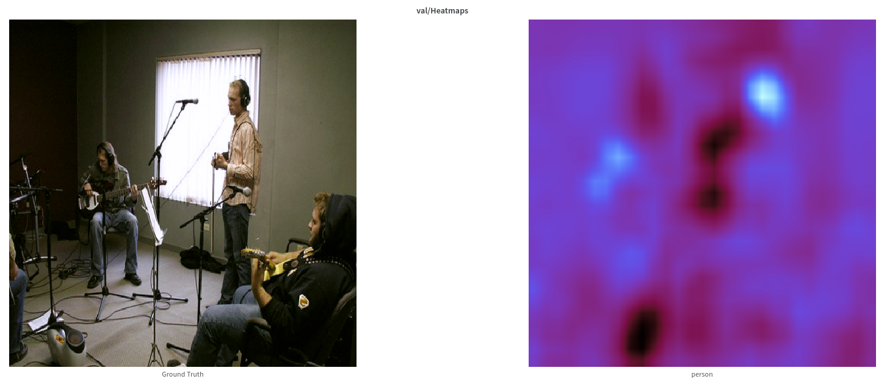
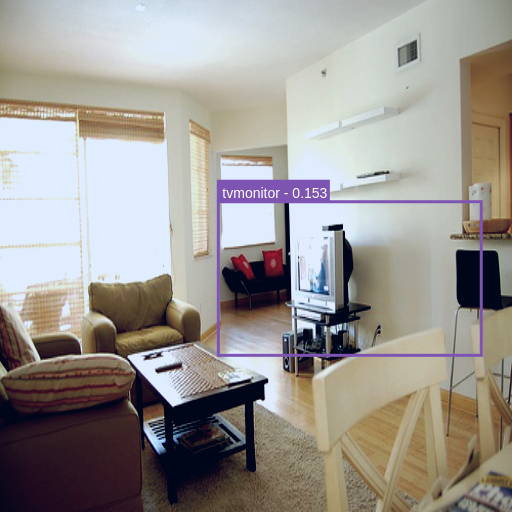

# Assignment 2: Weakly Supervised Object Localization

## Task 0: Visualization and Understanding the Data Structures

### Q 0.1: What classes does the image at index 2020 contain (index 2020 is the 2021-th image due to 0-based numbering)?

- The image at index 2020 belongs to the class - Train

### Q 0.2: You might have noticed that each image has a certain number of proposals from selective search. Often, this number is a lot more than we require. What is the easiest way to select the most informative regions? (Hint: look at the scores corresponding to each proposal in `voc_2007_trainval.mat`).

**Answer:**
- In selective search, the regions proposed are based on the following criteria - color, texture, shape, size and fill. A similarity measure for each of these is calculated per region proposal. The sum of these 4 similarities gives the final confidence score for that region proposal. Higher the value of this confidence score, the better is the proposed region supposedd to be. Thus, in order to select the most informative regions, we could just sort them in the descending order of their scores and then take the top n regions.

### Q 0.3 Use Wandb to visualize the ground-truth bounding box and the class for the image at index 2020.

### Q 0.4 Use Wandb to visualize the top ten bounding box proposals for the image at index 2020.

## Task 1: [Is Object Localization Free?](https://www.di.ens.fr/~josef/publications/Oquab15.pdf)

### Q 1.1 Fill in each of the TODO parts except for the functions ``metric1``, ``metric2`` and ``LocalizerAlexNetRobust``. In the report, for each of the TODO, describe the functionality of that part. The output of the above model has some spatial resolution. Make sure you read paper [1] and understand how to go from the output to an image level prediction (max-pool). (Hint: This part will be implemented in ``train()`` and ``validate()``.

**Answer:**
- **LocalizerAlexNet** - Added the model architecture in this class. Using the paper as a reference, created a model that essentially has two parts - an AlexNet block for feature extraction and a FCN/COnvolutional Adaptation layers for classifier. This fully convolutional architecture could take in any arbitrarily sized imamge and get 20 (n_classes) final feature maps each corresponding to one of the class.

- **localizer_alexnet** - Added a support method that would create a new model object and ensure the correct weights would be assigned. In case of pretrained, the AlexNet feature extractor would be assigned pretrained weights while other layers would be initialized using Xavier initialization. In case of no pretrained weights, all layers would be initialized using Xavier initialization.

- **Optimizer, Loss and LR Scheuler** - Inspired from the original paper, added a SGD optimizer with momentum and weight decay. Also, added a multilabel classification loss (BCE) to ensure the network learns correctly. Also, added a LR scheduler (StepLR) to ensure that learning doesn't plateau or converge at some minima.

- **train** - Added forward propagation and backprop code to the train method. To train the network, the arbitrary output of size (b, 20, k, k) where b is the batch size and k would be the size of the feature map post downsampling through the network, would be converted to (b, 20) by a global maxpooling operation done to gather the most activated feature value. This would be used as the score to judge the overall multi-label classification.

- **validate** - Added code to forward prop and calculate the loss in a manner similar to that mentioned above.

### Q 1.2 What is the output resolution of the model?

**Answer:**
- Considering a batch size of 32, the output size is **(32, 20, 29, 29)**. Thus, the final output feature maps have a resolution of 29 x 29.

### Q 1.4 In the first few iterations, you should observe a steep drop in the loss value. Why does this happen? (Hint: Think about the labels associated with each image).

**Answer:**
In the first few iterations, the model ends up predicting all classes to be present in all images. This leads to no false negatives (even though there are false positives). This leads to a high recall in the iteration (this completely drops to zero and remains stable after 2-3 iterations). Due to the overall high false positives and misclassifications, the loss is high.

On an average, each image will have less than 50% of the total classes in it. Say, on average an image has 2 out of the 20 classes. So, the model in the beginning classifies the 2 correctly but the rest incorrectly. Thus, the model starts focussing on fixing these immediately and ends up moving to predicting almost all classes as absent. This leads to correctly handling the 18 classes while misclassifying the 2 that are actually present. But as per the loss, the model has gone from correctly classifying 2 out of 20 classes to 18 out of 20 classes in a short amount of time leading to a steep drop.

### Q 1.5 We will log two metrics during training to see if our model is improving progressively with iterations. The first metric is a standard metric for multi-label classification. Do you remember what this is? Write the code for this metric in the TODO block for ``metric1`` (make sure you handle all the boundary cases). However, ``metric1`` is to some extent not robust to the issue we identified in Q1.4. The second metric, **Recall**, is more tuned to this dataset. Even though there is a steep drop in loss in the first few iterations ``metric2`` should remain almost constant. Implement it in the TODO block for ``metric2``. (Make any assumptions needed - like thresholds).

**Answer:**

The standard metric for multi-label classification that's being implemented here is mean average precision.

- **Metric1 / mAP** - Added code by slightly modifying the util function written for hw1 to compute AP for each of the classes. This function was slightly modified to handle the torch tensors input. So, overall this code block would help calculate the APs per class and the mAP which is a useful metric to measure the performance of the model.

- **Metric2 / Recall** - Added code to calculate recall by simply finding the true positives and false negatives at a fixed threshold. This gives an average of the recall for the multiple classes. It is a useful metric to measure how many of the actual objects were ignored or misclassified by the model.

### Q 1.6 Initialize the model from ImageNet (till the conv5 layer), initialize the rest of layers with Xavier initialization and train the model using batchsize=32, learning rate=0.01, epochs=30. Evaluate every 2 epochs.

**Answer:**

Note: In each of the heatmap examples, heatmap for only 1 label has been shown. The name of the class is mentioned below the heatmap in the image.

- **Metrics**

|   | Metric1 |
| - | ------- |
| **Training** |  |
| **Validation** |  |

|   | Metric2 |
| - | ------- |
| **Training** |  |
| **Validation** |  |

- **Training heatmaps - First Epoch**

|   | Heatmap |
| - | ------- |
| **Example 1** |  |
| **Example 2** |  |

- **Training heatmaps - Last Epoch**

|   | Heatmap |
| - | ------- |
| **Example 1** |  |
| **Example 2** |  |

- **Validation Heatmaps at the end of training**

|   | Heatmap |
| - | ------- |
| **Example 1** |  |
| **Example 2** |  |
| **Example 3** |  |

- **Loss, Metric 1 and Metric 2**

|   | Loss | Metric 1 | Metric 2 |
| - | ---- | -------- | -------- |
| **Training** | 0.0741 | 0.918 | 0.7341 |
| **Validation** | 0.1702 | 0.6303 | 0.4545|

#### Q 1.7 In the heatmap visualizations you observe that there are usually peaks on salient features of the objects but not on the entire objects. How can you fix this in the architecture of the model?

**Answer:**

Note: In each of the heatmap examples, heatmap for only 1 label has been shown. The name of the class is mentioned below the heatmap in the image.

- **Metrics**

|   | Metric1 |
| - | ------- |
| **Training** |  |
| **Validation** |  |

|   | Metric2 |
| - | ------- |
| **Training** |  |
| **Validation** |  |

- **Training heatmaps - First Epoch**

|   | Heatmap 1.6 | Heatmap 1.7 |
| - | ----------- | ----------- |
| **Example 1** |  |  |
| **Example 2** |  |  |

- **Training heatmaps - Last Epoch**

|   | Heatmap 1.6 | Heatmap 1.7 |
| - | ----------- | ----------- |
| **Example 1** |  |  |
| **Example 2** |  |  |

- **Validation Heatmaps at the end of training**

|   | Heatmap |
| - | ------- |
| **Example 1** |  |
| **Example 2** |  |
| **Example 3** |  |

- **Loss, Metric 1 and Metric 2**

|   | Loss | Metric 1 | Metric 2 |
| - | ---- | -------- | -------- |
| **Training** | 0.0638 | 0.9907 | 0.7667 |
| **Validation** | 0.1452 | 0.761 | 0.6667|

## Task 2: [Weakly Supervised Deep Detection Networks](https://www.robots.ox.ac.uk/~vgg/publications/2016/Bilen16/bilen16.pdf)

- **Loss**

- **Test mAP**

- **Class-wise AP Plots**

|   | Average Precision vs Iterations |
| - | ------- |
| **Aeroplane** |  |
| **Bird** |  |
| **Horse** |  |
| **Person** |  |
| **Train** |  |

- **Bounding Box Examples**

|   | Epoch 1| Epoch 5 |
| - | ----------- | ----------- |
| **Example 1** |  |  |
| **Example 2** |  |  |
| **Example 3** |  |  |
| **Example 4** |  |  |
| **Example 5** |  |  |
| **Example 6** |  |  |
| **Example 7** |  |  |
| **Example 8** |  |  |
| **Example 9** |  |  |
| **Example 10** |  |  |
| **Example 11** |  |  |

- **Classwise APs and mAP**

| Class | Average Precision |
| ----- | ----------------- |
| aeroplane | 0.1143 |
| bicycle | 0.0705 |
| bird | 0.0574 |
| boat | 0.0186 |
| bottle | 0.0014 |
| bus | 0.0437 |
| car | 0.063 |
| cat | 0.1121 |
| chair | 0.0005 |
| cow | 0.0148 |
| diningtable | 0.0397 |
| dog | 0.0579 |
| horse | 0.1268 |
| motorbike | 0.0993 |
| person | 0.0188 |
| pottedplant | 0.012 |
| sheep | 0.0349 |
| sofa | 0.0193 |
| train | 0.1203 |
| tvmonitor | 0.031 |

**mAP = 0.0528**

- I tried multiple things to improve the overall model performance - trying multiple learning rates, different learning rate schedulers, training for higher epochs etc. But none of these led to any improvement.

- Considering the time and GPU constraints and the large amount of time required per run, I had to be happy with an mAP around ~5.3%

While the loss was actually going down

the model started to overfit and the performance started to dip

Though some of the previously shown examples started seeing better predictions,

|   |   |
| - | - |
|  |  |

some started showing poor behavior

|   |   |
| - | - |
|  |  |

