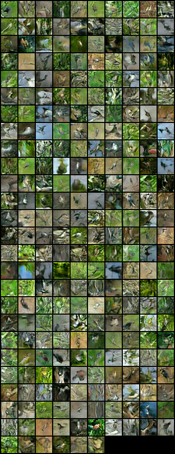
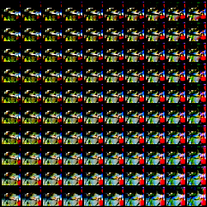
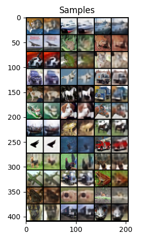
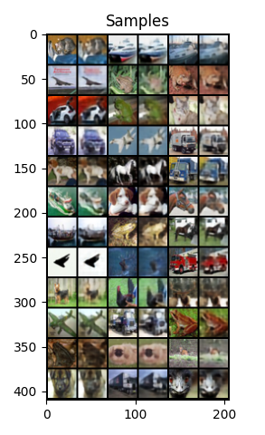
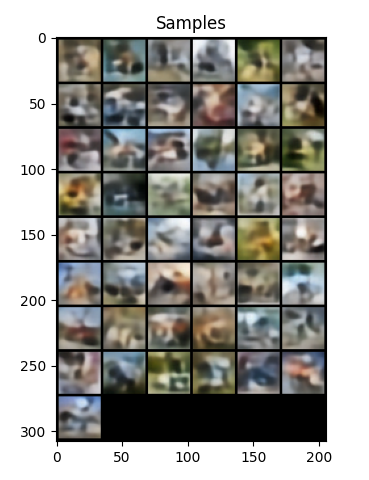

# Assignment 3: Generative Modeling

## Question 1.3.3: GAN Analysis

 

### What is the final FID attained? Additionally, please plot the fid score with respect to training iterations and report the final score.

**Answer:**

- Final FID attained - **60.97**
- FID vs Iterations Plot

- FID @ Iteration 30000: **68.42**

 

### How do the samples look? Please plot them here.

**Answer:**

- The final samples do contain features related to birds.
- However, high frequency jittering are visible in some of the samples.
- A lot of the samples have primarily the same color or background (green) indicating some essence of how the training data is.
- Some samples also contain some odd presence of red gradient.

 

### How does the latent space interpolation look, is the latent space disentangled at all?

**Answer:**

- Latent space disentanglement can be seen along one of the dimensions.
- As can be seen along any column, the latent space interpolation gets bluer.

 

### As you may have noticed, the FID jumps around a lot (can range from 100 to 150) and the final samples do not look very good. Please describe in your own words why you think this might be the case.

**Answer:**
- While in my experiment the FID didn't shoot up in the end, there were still visible spikes around iteration 10k and 28k.

| Iter 10k | Iter 28k |
| -------- | -------- |
|  |  |

- FID is calculated as shown below

- Intuitively, FID seems to measure how similar the generated data is to the training samples. This also includes a comparison of diversity of the data samples.

- In the iter 10k samples, it looks like the Generator has found certain features (presence of green features) on which it is able to successfully fool the discriminator. Hence, the training signal of the Generator would drop. However, this "better" Generator performance based on the loss would be a lie. When calculating FID, these images wouldn't seem similar to data from the the training set leading to rise in high FID.

- In the iter 28k samples, it looks like the generator is producing samples related to certain features (different shades of bluish gray) on which it is again able to successfully fool the discriminator. So, again similar to the reason above, the FID score would increase a bit.

- These decrease again once the discrimnator gets enough training signal to recognize them as fake.

 

## Question 1.4.3: LSGAN Analysis

 

### What is the final FID attained? Additionally, please plot the fid score with respect to training iterations and report the final score.

**Answer:**

- Final FID attained - **55.23**
- FID vs Iterations Plot

- FID @ Iteration 30000: **63.25**

 

### How do the samples look? Please plot them here.

**Answer:**

- The samples look diverse and contain bird like features.
- The reconstructions are sharper than that of Vanilla GAN.
- However, some of the samples seem to be majorly covered by red blobs.

 

### How does the latent space interpolation look, is the latent space disentangled at all?

**Answer:**

- There's disentanglement along one dimension.
- Along a row, the red bird-like component increases.
- However, along both dimensions, the green shade moves towards a lighter bluish green shade.

 

### If this section was implemented correctly, you should have a final FID in the ballpark of *90* and the samples should look reasonable at this point (you should see some birds but they might be imperfect). In your own words, describe why you think this version of the GAN loss was more stable than the original.

- In case of Vanilla GAN, once the Generator starts producing samples such that the it fools the discriminator with high confidence, the overall training signal that the Generator gets is close to 0.
- This is because the training signal is essentially calculated as the log(sigmoid(D(G(x)))). At high confidence, the log values would be close to 0 leading to vanishing gradients.
- However, in case of LSGAN, the MSE loss on the raw output still leads to a good training signal in the above case.
- This loss signal, similar to distance calculation, is 0 only when the disciminator output for the generated sample is all 1s. As the values go further from this in any direction, regardless of whether Discriminator identifies it as fake or real.

 

## Question 1.5.3: WGAN-GP Analysis

 

### What is the final FID attained? Please plot the fid score with respect to training iterations and report the final score.

**Answer:**

- Final FID attained - **32.41**
- FID vs Iterations Plot

- FID @ Iteration 30000: **33.60**

 

### How do the samples look? Please plot them here.

**Answer:**

- The samples generated look sharp, diverse and are mostly devoid of any unnatural artifacts.

 

### How does the latent space interpolation look, is the latent space disentangled at all?

**Answer:**

- There is disentanglement visible along rows.
- The red bird's shade changes from dull/darker to bright/lighter.

 

### If this section was implemented correctly, you should have a final FID in the ballpark of *50* and the samples should look reasonable at this point (you should see some birds that look reasonable). In your own words, describe why you think this version of the GAN loss was so much more stable and performant than the previous two.

- Vanilla GAN uses JS divergence as a metric to measure the distance between the data distribution and the distribution of generated samples. However, in cases where these distributions are far apart or disjoint, the JS divergence has a sudden jump and so, wouldn't be differentiable there. However, Wasserstein distance, as used by WGAN-GP, is smooth and continuously differentiable. Also, in order to ensure the critic's convergence, the Lipschitz continuity needs to be ensured which we do by ensuring the norm of the gradient is close to 1.

 

## Question 2.1: AutoEncoder

 

### Plot the reconstruction loss (for the valiation data) versus number of epochs trained on for all three latent size settings on the same plot.

**Answer:**

 

### Include the reconstruction plots from epoch19 for each latent setting. Which latent size performs best? What are possible reasons for this?

**Answer:**

| 16 | 128 | 1024 |
| -- | --- | ---- |
|  |  |  |

- As per the above reconstructed samples, latent feature vector of size 1024 performs the best. A larger latent size has more representational power and thus, can capture a more detailed representation of the input.

 

## Question 2.2: Variational Auto-Encoder

 

### Plot the reconstruction loss and kl loss (for the valiation data) versus number of epochs (separate plots). Recon loss of reference solution is < 145 at epoch 19 (remember to average only across batch dimension).

**Answer:**

- Reconstruction Loss (Recon Loss @ epoch19: 137.28)

- KL Loss (KL loss @ epoch19: 60.58)

 

### Include reconstruction and sample plots from epoch 19.

**Answer:**

| Reconstruction | Samples |
| -------------- | ------- |
|  |  |

 

## Question 2.3: Beta Variational Auto-Encoder

 

### Compare the performance of the models with beta values 0.8, 1, 1.2. (Recon loss at epoch 19 of reference solutions are < 130 for beta0.8, and <155 for beta1.2)

**Answer:**

- Reconstruction Loss:
  - Recon loss @ beta=0.8, epoch 19 - 125.14
  - Recon loss @ beta=1.2, epoch 19 - 148.77

- KL Loss:

- Total Loss:

 

### Comment on the recon loss, kl loss and quality of samples. (Even with tuning, the samples will still be blurry)

| Samples - 0.8 | Samples - 1 | Samples - 1.2 |
| ------------- | ----------- | ------------- |
|  |  |  |

- As the beta value increases, the weightage of KL loss increases. So, the overall importance of reconstruction loss decreases. Thus, higher the beta value, higher is the reconstruction loss and lower is the KL loss.

- From the Total Loss graph, for all betas, the total losses are close.

- Based on the above reasoning, it only makes sense that the lower beta samples will be sharper as the model tries to lower the reconstruction loss more.

 

### For what value of beta does the VAE reduce to an auto-encoder?

- For a beta value of 0 (zero), beta VAE reduces to an auto-encoder.

 

## Question 2.3.2: Linear schedule for beta

 

### Include plots of samples from epoch 19. Plot the recon loss across epochs (Recon loss at epoch 19 of reference solution is < 125)

**Answer:**

- Reconstruction Loss (Recon loss @ epoch 19 - 123.44)

 

### How do these compare to those from the vanilla VAE ?

**Answer:**

| Sample - Linearly Scheduled Beta | Sample - Vanilla VAE |
| -------------------------------- | -------------------- |
|  |  |

- As per the above samples, the beta VAE with linearly scheduled beta values is doing better than vanilla VAE. The samples are sharper.
- Vanilla VAE gives a weightage of 1 to KL loss. So, the model tries reducing the KL loss as well during training along with reconstruction loss.
- However, linearly scheduled beta VAE initially focuses on reducing the reconstruction loss. Thus, it focuses on getting better and sharper images and with time focuses on the overall diversity of samples.

 
