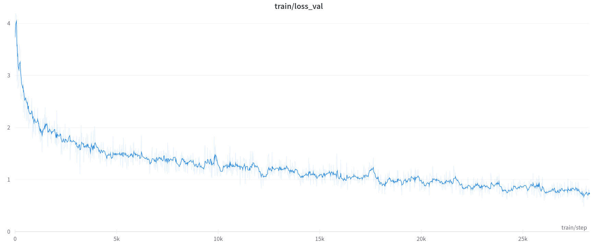

# Assignment 4: Visual Question Answering with PyTorch

## Commands to Run

```bash
# Run Simple Baseline Training
python main.py

# Run Coattention Network training
python main.py --model coattention --cache_location /content/cache
```
## Drive Links

|  | Link |
| - | ---- |
| Simple Baseline Checkpoint | https://drive.google.com/file/d/1BnZwpai5zi1ykz_OHieHINjcGDGgOX3R/view?usp=sharing |
| Simple Baseline Wandb Logs | https://drive.google.com/drive/folders/14cdlVyIYRKGKFWb1XYM2Qh1c-rrrpEsV?usp=sharing |
| Coattention Checkpoint | https://drive.google.com/file/d/16A_5ohn9SimOJiHdSwf79T1ortaMy9OT/view?usp=sharing |
| Coattention Wandb Logs | https://drive.google.com/drive/folders/191Zggvd-xjq-c5wdDVqwpFFphP19ASMf?usp=sharing |

<br>

***

<br>

## Task 1: Data Loader (30 points)

<br>

### 1.1 Which member function of the `VQA` class returns the IDs of all questions in this dataset? How many IDs are there?

**Answer:**
- The member function `getQuesIds()` returns the IDs of all questions.
- Train data has a total of `248349` questions
- Val data has a total of `121512` questions.

<br>

### 1.2 What is the content of the question of ID `409380`? What is the ID of the image associated with this question?
    Hint for later tasks: This image ID can be padded with 0s (and prefix and suffix) to obtain the image file name.

**Answer:**
- The questions associated with ID `409380` - `What position is the man squatting with a glove on playing?`
- The image Id associated with the above question - `40938`
- The corresponding image -


<br>

### 1.3 What is the mostly voted answer for this question?

**Answer:**
- The 10 answers associated with the question are - `[catcher, catcher, catcher, catcher, catcher, catcher, baseball, catcher, catcher, catcher]`
- So, the mostly voted answer is `catcher`.

<br>

### 1.7 Assign `self.answer_to_id_map` in the `__init__` function. Different from the word-level question embedding, the answer embedding is sentence-level (one ID per sentence). Why is it?

**Answer:**
- The answers in the dataset aren't exactly sentences but just keywords.
- Some answers could have 2 or 3 keywords like `semi circle`, `black white`.

### 1.8 Implement the `__len__` function of the `VqaDataset` class. Should the size of the dataset equal the number of images, questions or the answers? Show your reasoning.

**Answer:**
- The size of the dataset should be equal to the number of questions.
- Each image can have more than 1 questions assocaited with it. So, if the number of images is used as the dataset length, the corresponding question id would have to be randomly sampled from the associated question which would be unnecessary and would also lead to each question not being covered in an epoch.
- Thus, in order to utilize the entire dataset completely, number of questions should be used.

### 1.9 Implement the `__getitem__` function. You need to (1) figure out what is the `idx`-th item of the dataset; (2) load the associated image; (3) encode the question and answers.

1. For now, assume that `cache_location` and `pre_encoder` are both `None`. We will come back to this in Task 3.
2. After you load the image, apply `self._transform` if it exists; otherwise apply `torchvision.transforms.ToTensor`.
3. Create **word-level one-hot encoding** for the question. Make sure that your implementation handles words not in the vocabulary. You also need to handle sentensences of varying lengths. Check out the `self._max_question_length` parameter in the `__init__` function. How do you handle questions of different lengths? Describe in words, what is the dimension of your output tensor?

**Answer:**
- In order to handle questions of varying lengths, we can compute the maximum length across all questions.
- By setting the #words dimension equal to this maximum value, we ensure that all questions can be dealt with and at the same time, we ensure that the tensor dimensions remain same and can be batched.
- The dimension of a single output question tensor would be the number of words (which would be set to the maximum length across all questions) and for each of these words, a one hot encoded vector of size same as the distinct number of words across all questions.
- That is, maximum length of a question x question words list size.

4. Create sentence-level **one-hot encoding** for the answers. 10 answers are provided for each question. Encode each of them and stack together. Again, make sure to handle the answers not in the answer list. What is the dimension of your output tensor?

**Answer:**
- The dimension of a single output answers tensor would be the number of answers per question - 10, and the distinct answers list length.
- That is, 10 x answers list length.

<br>

***

<br>

## Task 2: Simple Baseline (30 points)

### 2.1 This paper uses 'bag-of-words' for question representation. What are the advantage and disadvantage of this type of representation? How do you convert the one-hot encoding loaded in question 1.9 to 'bag-of-words'?

**Answer:**
- Bag of Words (bow) representation encodes the frequency information of the words appearing in a sentence.
- In terms of advantages, bow representation is intuitive and easy to compute.
- In terms of disadvantages, bow loses the sequential context of a sentence. Besides this, it emphasizes words purely based on frequency. This leads to words like `a`, `the` etc., which have a tendency to appear frequently, are emphasized more than the actual  action words or subjects.
- The one-hot encoding question tensor is converted to a bow representation by simply summing up the one-hot encoded vectors for each word.

<br>

### 2.2 What are the 3 major components of the network used in this paper? What are the dimensions of input and output for each of them (including batch size)? In `student_code/simple_baseline_net.py`, implement the network structure.

**Answer:**
- The 3 components
  - Image Feature Extractor (GoogleNet) - This takes in an image and returns a feature vector.
  - Word Feature Extractor (1 FC) - This takes in the bag-of-words representation of the question and converts it to a feature vector of length same as that of the Image Feature Extractor.
  - Classifier (1 FC) - This takes a concatenation of the Image and Word feature vectors and classifies it across `n` classes. Here `n` is the answers list size.

<br>

- Assuming a batch size of 100,

| Component | Input Dim | Output Dim |
| --------- | --------- | ---------- |
| Image Feature Extractor | (100, 5747) | (100, 1024) |
| Word Feature Extractor | (100, 3, 224, 224) | (100, 1024) |
| Classifier | (100, 2048) | (100, 5217) |

<br>

### *2.4 In `student_code/simple_baseline_experiment_runner.py`, specify the arguments `question_word_to_id_map` and `answer_to_id_map` passed into `VqaDataset`. Explain how you are handling the training set and validation set differently.

**Answer:**

| Dataset | question_word_to_id_map | answer_to_id_map |
| --------- | --------- | ---------- |
| train_dataset | `None` | `None` |
| val_dataset | `train_dataset.question_word_to_id_map` | `train_dataset.answer_to_id_map` |

- For train dataset, the values passed for both `None`. This is because we want these values - the question words and answers, to be derived from the training data.
- For validtion dataset, the values passed would be the corresponding member attributes of the train dataset.
    - The model has been trained to classify based on the train dataset maps.
    - So, if we try to derive the mapping from validation dataset, it is possible that the mapping could include new words or the mapping of certain words could change as compared to the train set map.
    - This would lead to incorrect metrics/accuracy as the meaning of a particular class would be different for the model and for the validation set.

<br>

### 2.5 In `student_code/simple_baseline_experiment_runner.py`, set up the PyTorch optimizer. In Section 3.2 of the paper, they explain that they use a different learning rate for word embedding layer and softmax layer. We recommend a learning rate of 0.8 for word embedding layer and 0.01 for softmax layer, both with SGD optimizer. Explain how this is achieved in your implementation.

**Answer:**
- The model comprises of 3 components - `image_feature_extractor`, `word_feature_extractor`, and `classifier`.
- The pretrained layers of the googlenet image feature extractor were frozen and the parameter `requires_grad` was set to False.
- Two optimizers were created - one for the word feature extractor and the other for the classifier.
- To the first optimizer, only the parameters of the word feature extractor were passed.
- Similarly, only the parameters of the classifier were passed to the other optimizer.

<br>

### 2.7 In `student_code/simple_baseline_experiment_runner.py`, implement the `_optimize` function. In Section 3.2 of the paper, they mention weight clip. This means to clip network weight data and gradients that have a large absolute value. We recommend a threshold of 1500 for the word embedding layer weights, 20 for the softmax layer weights, and 20 for weight gradients. What loss function do you use?

**Answer:**
- Considering this is a multi-class classification problem, using a Cross Entropy loss would be the ideal choice.

<br>

### 2.10 Describe anything special about your implementation in the report. Include your figures of training loss and validation accuracy. Also show input, prediction and ground truth in 3 different iterations.

**Answer:**

- I was able to get good results within 20 epochs. I also tried caching the googlenet outputs for images to make things faster and reduce memory load but failed miserably. So, had to revert to implementation without caching.

| Title | Plot |
| ----- | ---- |
| Training Loss |  |
| Validation Accuracy |  |

- Note that the validation accuracies were computed on a set of 3750 images.
- The accuracy of the best model on the entire validation set - **0.5043**.

<br>

- Image, Prediction and GT at 3 different iterations

| Epoch | Image | Question | GT | Prediction |
| ----- | ----- | -------- | -- | ---------- |
| 0 |  | Is the child wearing a vest? | yes | black/white |
| 2 |  | Is the child wearing a vest? | yes | no |
| 19 |  | Is the child wearing a vest? | yes | yes |

<br>

***

<br>

## Task 3: Co-Attention Network (30 points)

<br>

### 3.1 Set up transform used in the Co-attention paper. The transform should be similar to question 2.3, except a different input size. What is the input size used in the Co-Attention paper [3]? Here, we use ResNet18 as the image feature extractor as we have prepared for you.
    Similar to 2.4, specify the arguments `question_word_to_id_map` and `answer_to_id_map` passed into `VqaDataset`.

**Answer:**
- The input size as per the paper is 448x448.

<br>

**3.3 Implement Co-attention network in `student_code/coattention_net.py`. The paper proposes two types of co-attention: parallel co-attention and alternating co-attention. In this assignment, please focus on the alternating co-attention.**

We have implemented the **hierarchical question feature extractor** and the **alternating co-attention module** for you. Please make sure you understand them first by referring the paper, and then use them to implement the **\_\_init\_\_** and **forward** functions of the **CoattentionNet** class. You should add **no** new lines to the **\_\_init\_\_** function and input **less than 20** lines for the **forward** function.

**In the report, use you own words to answer the following questions.**

1. What are the three levels in the hierarchy of question representation? How do you obtain each level of representation?

**Answer:**
- The three levels of hierarchy include a word level, phrase level and sentence level.
- The word level representation are created by generating an appropriate feature vector using a fully connected layer.
- The word level representations are taken and  unigram, bigram and trigram representations are created. These are created using a 1d convolution of filter size 1, 2, and 3 respectively (with appropriate padding). Then a pooling operation over the three representation gives the final phrase level representation.
- The phrase representation is passed through a LSTM setup to understand the sequential context. This gives the sentence level representation.

2. What is attention? How does the co-attention mechanism work? Why do you think it can help with the VQA task?

**Answer:**
- Attention is a mechanism that helps highlight the important part while fading out the not so relevant part. For example, in order to classify weather conditions, the important part of the image would be the sky part. So, you would want your model to pay attention to that part.
- Rather than just focusing on certain parts of the image or the question, Coattention provides a mechanism to jointly reason about both visual attention and question attention.
- In VQA task, you idedally want to figure out the important part of the question to better understand it and using this, figure out what to look at in the image and figure out the answer.
- In case of alternating coattention, the image and question attentions are generated alternately to leverage both their information and context to answer better.

3. Compared to networks we use in previous assignments, the co-attention network is quite complicated. How do you modularize your code so that it is easy to manage and reuse?

**Answer:**

- The Alternating Coattention is handled by a separate class called `AlternatingCoAttention`.
- Similarly, the hierarchical question feature extraction is handled by another class called `QuestionFeatureExtractor`.
- So, by having thse as separate classes, a lot of the complexity is abstracted and the code is easier to write, manage and these modules would be reusable.

<br>

### 3.5 Similar to question 2.10, describe anything special about your implementation in the report. Include your figures of training loss and validation accuracy. Compare the performance of co-attention network to the simple baseline.

**Answer:**

- I wasn't getting good results with RMSProp and so, had to change to Adam even though the paper recommended RMSProp.
- I had to be careful about the learning rate as that led to the validation accuracy plateauing and overfitting.
- With a good learning rate, I was able to get good results within 7 epochs.

| Title | Plot |
| ----- | ---- |
| Training Loss |  |
| Validation Accuracy |  |

- Note that the validation accuracies were computed on a set of 6250 images.
- The accuracy of the best model on the entire validation set - **0.5711** as compared to the 0.5043 of the baseline model.
- This model performs better than the simple baseline model in much lesser epochs.

<br>

- Image, Prediction and GT at 3 different iterations

| Epoch | Image | Question | GT | Prediction |
| ----- | ----- | -------- | -- | ---------- |
| 0 |  | What gender is the person? | female | yes |
| 2 |  | What gender is the person? | female | male |
| 7 |  | What gender is the person? | female | male |

## Task 4: Custom Network  (20 bonus points)

Brainstorm some ideas for improvements to existing methods or novel ways to approach the problem.

For 10 extra points, pick at least one method and try it out. It's okay if it doesn't beat the baselines, we're looking for creativity here; not all interesting ideas work out.

### 4.1 List a few ideas you think of (at least 3, the more the better).

**Answer:**
- Better sentence feature vectors using something like [paragraph2vec](https://cs.stanford.edu/~quocle/paragraph_vector.pdf) would be a good place to start and improve performance of the simple baseline.
- Instead of using googlenet as the image feature extractor, using a better network like ResNet would lead to better image representation and so, could help improve the results of the simple baseline.
- Instead of alternating, try using parallel coattention to see if having both the attentions helps change the performance.
- Instead of one-hot encoding, using word2vec as the word embedding could lead to better results.
- Varying the embedding size from 512 to 1024 would allow better representations.

### (bonus) 4.2 Implementing at least one of the ideas. If you tweak one of your existing implementations, please copy the network to a new, clearly named file before changing it. Include the training loss and test accuracy graphs for your idea.**

